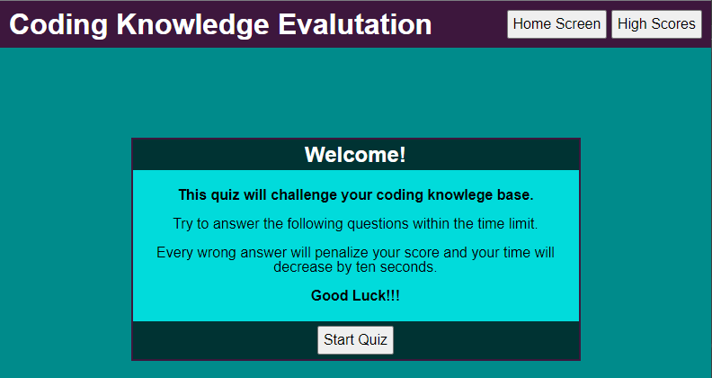

# coding-quiz

This is an application to quiz a user on their coding knowledge

## Description

The application has several sections. Only one section is displayed at a time to give the user a SPA-like experience.
1. index (home screen)
2. question-box (quiz)
3. results (score after quiz is completed)
4. high-scores (shows the top 10 high scores)

When the quiz is not in process, the user can navigate to either the "home screen" or the "high scores". When the quiz is active, these buttons become disabled.

When the quiz begins, the timer starts and the user is prompted with a series of pre-defined questions. These questions are hard coded into the JavaScript. They are randomized so that both the order of the questions and the order of the possible choices changes each time a user takes the quiz.

If a user gets an answer right, they are awarded 10 points.
If a user gets an answer wrong, they do not receive any points and the time is decreased by 10. 
A timed message shows whether the response was right or wrong.
The quiz is completed when either all the questions have been answered or time runs out. The user is notifed of their completion type.

Once complete, the results screen shows the users score and is prompted to enter their initials. IF they are in the top 10 highest scores, their score is saved to local storage and will appear on the high scores list.

From the high score screen, a user can clear the high score, start the quiz again or navigate to the main page.

## Getting Started
[Launch Coding Quiz](https://dmmerchant.github.io/coding-quiz/)

### Dependencies

* Strictly HTML, CSS, and Javascript. No additional additional requirements

